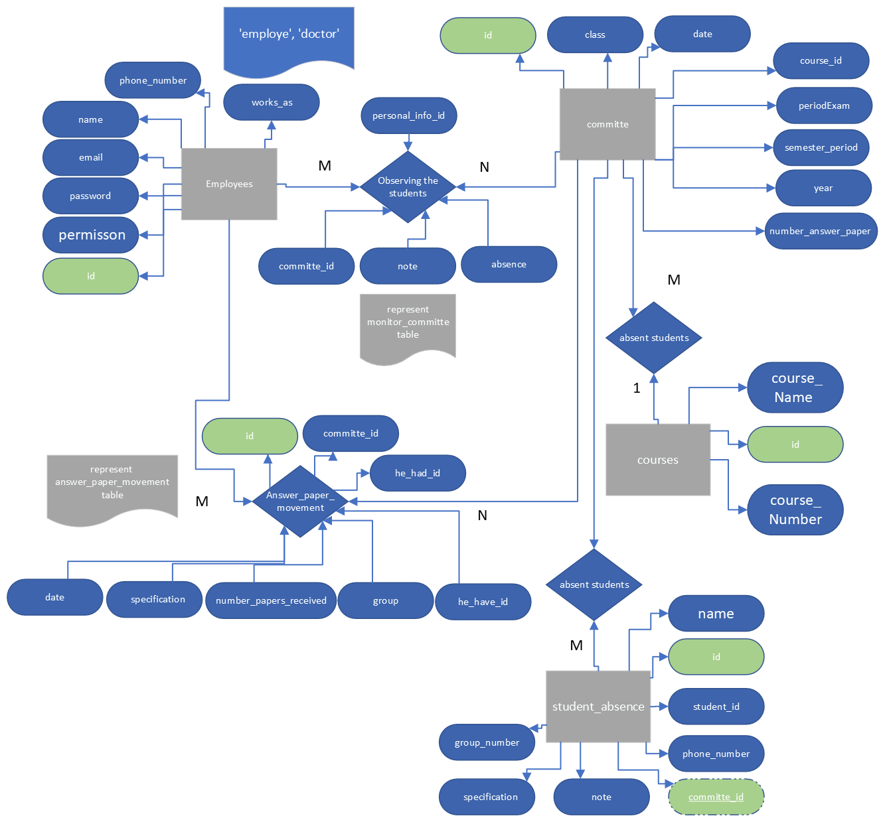

# CET_ExamOrganize [Install and run]

<h3> 1- download repo by press on Code [green button] by Download ZIP </h3>

<h3> 2- extract ZIP file  </h3>

<h3> 3- download xampp from [ https://www.apachefriends.org/download.html ] to install mysql & php to give you access to database & reports</h3>

<h3> 4- open C:\xampp and run xampp-control.exe then start Apache & MySql </h3>

<h3> 5- open [ https://127.0.0.1/phpmyadmin/ ] & Create a database by press on New and name it "organize_exam" and press Create button </h3>

<h3> 6- press on button Import and click on Browse and go to CET_ExamOrganize/db/organize_exam.sql then click on Import</h3>

<h2>#part two</h2>

<h3> 1- move to CET_ExamOrganize/Reports/ and copy folder exam_organize/ to C:/xampp/htdocs/  </h3>

<h3> 2- if you don't have java verison "19.0.2" download it from [ https://www.techspot.com/downloads/7508-java-19.html ] </h3>

<h3> 3- move to CET_ExamOrganize/out/artifacts & run exam.v3.jar </h3>

<h3> Describe Database by ERD</h3>

